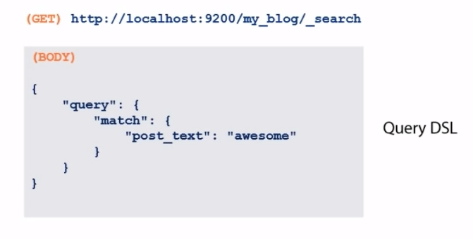
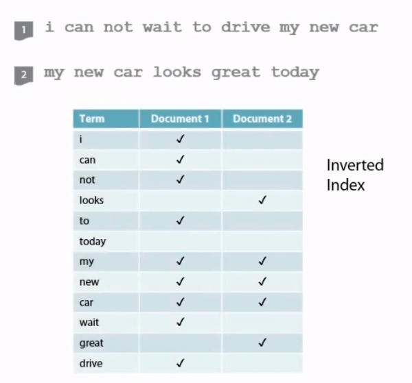
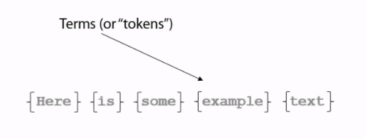

## 2021년11월02일_openserch3장Querying&Analysis

- http GET을 이용한 쿼리 검색
  - 고유 ID 또는 간단한 필드를 사용하여 신속하게 무언가를 찾고자 할때 유용
- `my_blog/_search?q=post_text:awesome`

## 사용하기

```json
DELETE my_blog

POST my_blog/post
{
  "mappings":{
      "post":{
          "properties":{
              "user_id":{
                  "type":"integer"
              },
              "post_text":{
                  "type":"text"
              },
              "post_date":{
                  "type":"date"
              },
              "post_word_count":{
                  "type":"integer"
              }
          }
      }
  }
}

POST my_blog/post
{
  "post_text":"yet another blog post!",
  "user_id":1,
  "post_date":"2021-10-30",
  "post_word_count":4
}

POST my_blog/post
{
  "post_text":"this is a wonderful blog post",
  "user_id":1,
  "post_date":"2021-10-28",
  "post_word_count":6
}

POST my_blog/post
{
  "post_text":"i really enjoy writing blog posts",
  "user_id":2,
  "post_date":"2021-10-15",
  "post_word_count":6
}

GET my_blog/post/_search?q=post_text:blog
```

## 결과 | blog를 포함하는것 

```json
{
  "took" : 4,
  "timed_out" : false,
  "_shards" : {
    "total" : 1,
    "successful" : 1,
    "skipped" : 0,
    "failed" : 0
  },
  "hits" : {
    "total" : {
      "value" : 3,
      "relation" : "eq"
    },
    "max_score" : 0.14874382,
    "hits" : [
      {
        "_index" : "my_blog",
        "_type" : "post",
        "_id" : "7bMN4XwBXp7KZOVOYDFL",
        "_score" : 0.14874382,
        "_source" : {
          "post_text" : "yet another blog post!",
          "user_id" : 1,
          "post_date" : "2021-10-30",
          "post_word_count" : 4
        }
      },
      {
        "_index" : "my_blog",
        "_type" : "post",
        "_id" : "7rMN4XwBXp7KZOVObjHP",
        "_score" : 0.12703526,
        "_source" : {
          "post_text" : "this is a wonderful blog post",
          "user_id" : 1,
          "post_date" : "2021-10-28",
          "post_word_count" : 6
        }
      },
      {
        "_index" : "my_blog",
        "_type" : "post",
        "_id" : "77MN4XwBXp7KZOVOdDGA",
        "_score" : 0.12703526,
        "_source" : {
          "post_text" : "i really enjoy writing blog posts",
          "user_id" : 2,
          "post_date" : "2021-10-15",
          "post_word_count" : 6
        }
      }
    ]
  }
}
```

## wonderful 포함 하는것 검색

```josn
GET my_blog/post/_search?q=post_text:wonderful
```

## 결과

```json
{
  "took" : 3,
  "timed_out" : false,
  "_shards" : {
    "total" : 1,
    "successful" : 1,
    "skipped" : 0,
    "failed" : 0
  },
  "hits" : {
    "total" : {
      "value" : 1,
      "relation" : "eq"
    },
    "max_score" : 0.9331132,
    "hits" : [
      {
        "_index" : "my_blog",
        "_type" : "post",
        "_id" : "7rMN4XwBXp7KZOVObjHP",
        "_score" : 0.9331132,
        "_source" : {
          "post_text" : "this is a wonderful blog post",
          "user_id" : 1,
          "post_date" : "2021-10-28",
          "post_word_count" : 6
        }
      }
    ]
  }
}
```

- 쿼리문자열 검색
  - Elasticsearch에서는 Search Lite라고함

## Quert DSL 사용

- DSL이란
  - Domain Specific Language
    - 도메인 특정 언어
  - elasticsearh는 특별히 구성된 json 스피넷을 쿼리로 허용함

 

## DSL 형식

```json
GET my_blog/post/_search
{
	"query":{
    	"match":{
        	"post_text": "wonderful"
      }
  }
}
```

## 결과

```json
{
  "took" : 2,
  "timed_out" : false,
  "_shards" : {
    "total" : 1,
    "successful" : 1,
    "skipped" : 0,
    "failed" : 0
  },
  "hits" : {
    "total" : {
      "value" : 1,
      "relation" : "eq"
    },
    "max_score" : 0.9331132,
    "hits" : [
      {
        "_index" : "my_blog",
        "_type" : "post",
        "_id" : "7rMN4XwBXp7KZOVObjHP",
        "_score" : 0.9331132,
        "_source" : {
          "post_text" : "this is a wonderful blog post",
          "user_id" : 1,
          "post_date" : "2021-10-28",
          "post_word_count" : 6
        }
      }
    ]
  }
}
```

## wonderful blog 쿼리 검색 시

```json
GET my_blog/post/_search
{
	"query":{
    	"match":{
        	"post_text": "wonderful blog"
      }
  }
}
```

## 결과

```json
{
  "took" : 5,
  "timed_out" : false,
  "_shards" : {
    "total" : 1,
    "successful" : 1,
    "skipped" : 0,
    "failed" : 0
  },
  "hits" : {
    "total" : {
      "value" : 3,
      "relation" : "eq"
    },
    "max_score" : 1.0601485,
    "hits" : [
      {
        "_index" : "my_blog",
        "_type" : "post",
        "_id" : "7rMN4XwBXp7KZOVObjHP",
        "_score" : 1.0601485,
        "_source" : {
          "post_text" : "this is a wonderful blog post",
          "user_id" : 1,
          "post_date" : "2021-10-28",
          "post_word_count" : 6
        }
      },
      {
        "_index" : "my_blog",
        "_type" : "post",
        "_id" : "7bMN4XwBXp7KZOVOYDFL",
        "_score" : 0.14874382,
        "_source" : {
          "post_text" : "yet another blog post!",
          "user_id" : 1,
          "post_date" : "2021-10-30",
          "post_word_count" : 4
        }
      },
      {
        "_index" : "my_blog",
        "_type" : "post",
        "_id" : "77MN4XwBXp7KZOVOdDGA",
        "_score" : 0.12703526,
        "_source" : {
          "post_text" : "i really enjoy writing blog posts",
          "user_id" : 2,
          "post_date" : "2021-10-15",
          "post_word_count" : 6
        }
      }
    ]
  }
}
```

- 위는 wonderful blog를 했지만 blog라는 문자열이 포함된 것 까지 가져옴
  - 단 차이는 가져온 쿼리 별로 _score를 내림차순으로 해서 보여줌 
  - `"_score" : 1.0601485,` - `"_score" : 0.14874382` -`"_score" : 0.12703526,`
    - 위처럼 가장 관련있는 것으로 점수가 높고 아니면 낮음

## 정확한 문장이나 문자열 찾기위한 방법

- Match Phrase

```json
GET my_blog/post/_search
{
	"query":{
    	"match_phrase":{
        	"post_text": "wonderful blog"
      }
  }
}
```

- "match"를 "match_phrase"로 하면 정확한 검색 결과를 얻을 수 있음

```json
{
  "took" : 8,
  "timed_out" : false,
  "_shards" : {
    "total" : 1,
    "successful" : 1,
    "skipped" : 0,
    "failed" : 0
  },
  "hits" : {
    "total" : {
      "value" : 1,
      "relation" : "eq"
    },
    "max_score" : 1.0601485,
    "hits" : [
      {
        "_index" : "my_blog",
        "_type" : "post",
        "_id" : "7rMN4XwBXp7KZOVObjHP",
        "_score" : 1.0601485,
        "_source" : {
          "post_text" : "this is a wonderful blog post",
          "user_id" : 1,
          "post_date" : "2021-10-28",
          "post_word_count" : 6
        }
      }
    ]
  }
}
```

## 복잡한 쿼리 실행

- 이전  버전의 경우

```json
GET my_blog/post/_search
{
	"query":{
	  "filtered"
    	"query":{match":{
        	"post_text": "wonderful blog"
      }
  }},
      "filter":{
          "term":{
            "user_id":"2"
        }
      }
    }
  }
}
```

- 위의 경우 없어짐

### query_string

```json
GET my_blog/_search
{
  "query": {
    "query_string": {
      "default_field": "post_text",
      "query": "post AND \"this is\""
    }
  }
}
```

- post_text 필드에서 
  - post와 this is가 있는것을 찾아라라는 뜻
  - 문장으로 쓰려면 `\"`안에 넣으면 됨 

## 하이라이팅 기능

```json
GET my_blog/post/_search
{
	"query":{
    	"match":{
        	"post_text": "wonderful blog"
      }
  },
  "highlight": {
    "fields": {
      "post_text":{}
    }
  }
}
```

- 이렇게 하면 `<em> </em>`
  - 태그로 감싸지게 나온다.

## 결과

```json
{
  "took" : 52,
  "timed_out" : false,
  "_shards" : {
    "total" : 1,
    "successful" : 1,
    "skipped" : 0,
    "failed" : 0
  },
  "hits" : {
    "total" : {
      "value" : 3,
      "relation" : "eq"
    },
    "max_score" : 1.0601485,
    "hits" : [
      {
        "_index" : "my_blog",
        "_type" : "post",
        "_id" : "7rMN4XwBXp7KZOVObjHP",
        "_score" : 1.0601485,
        "_source" : {
          "post_text" : "this is a wonderful blog post",
          "user_id" : 1,
          "post_date" : "2021-10-28",
          "post_word_count" : 6
        },
        "highlight" : {
          "post_text" : [
            "this is a <em>wonderful</em> <em>blog</em> post"
          ]
        }
      },
      {
        "_index" : "my_blog",
        "_type" : "post",
        "_id" : "7bMN4XwBXp7KZOVOYDFL",
        "_score" : 0.14874382,
        "_source" : {
          "post_text" : "yet another blog post!",
          "user_id" : 1,
          "post_date" : "2021-10-30",
          "post_word_count" : 4
        },
        "highlight" : {
          "post_text" : [
            "yet another <em>blog</em> post!"
          ]
        }
      },
      {
        "_index" : "my_blog",
        "_type" : "post",
        "_id" : "77MN4XwBXp7KZOVOdDGA",
        "_score" : 0.12703526,
        "_source" : {
          "post_text" : "i really enjoy writing blog posts",
          "user_id" : 2,
          "post_date" : "2021-10-15",
          "post_word_count" : 6
        },
        "highlight" : {
          "post_text" : [
            "i really enjoy writing <em>blog</em> posts"
          ]
        }
      }
    ]
  }
}
```

## elasticSearch 내장된 분석 기능

- 여기서는 Aggregations라고 부른다.
- 이것은 SQL용어에서 GROUP BY와 비슷하지만 더 강력함

```JSON
GET my_blog/post/_search
{
	"query":{
    	"match":{
        	"post_date": "2021-10-15"
      }
  },
  "aggs": {
    "all_words": {
      "terms": {
        "field": "post_date"
      }
    }
  }
}
```

## 결과

```json
{
  "took" : 2,
  "timed_out" : false,
  "_shards" : {
    "total" : 1,
    "successful" : 1,
    "skipped" : 0,
    "failed" : 0
  },
  "hits" : {
    "total" : {
      "value" : 1,
      "relation" : "eq"
    },
    "max_score" : 1.0,
    "hits" : [
      {
        "_index" : "my_blog",
        "_type" : "post",
        "_id" : "AbM94XwBXp7KZOVO7jJA",
        "_score" : 1.0,
        "_source" : {
          "post_text" : "i really enjoy writing blog posts",
          "user_id" : 2,
          "post_date" : "2021-10-15",
          "post_word_count" : 6
        }
      }
    ]
  },
  "aggregations" : {
    "all_words" : {
      "doc_count_error_upper_bound" : 0,
      "sum_other_doc_count" : 0,
      "buckets" : [
        {
          "key" : 1634256000000,
          "key_as_string" : "2021-10-15T00:00:00.000Z",
          "doc_count" : 1
        }
      ]
    }
  }
}

```

- post_text로 동영상에서는 했지만 제대로 동작되지 않아 post_date로 대체

## 개수에 대한 집계

```json
GET my_blog/post/_search
{
	"query":{
    	"match":{
        	"post_text": "blog"
      }
  },
  "aggs": {
    "avg_word_count": {
      "avg": {
        "field": "post_word_count"
      }
    }
  }
}
```

## 결과

```json
{
  "took" : 4,
  "timed_out" : false,
  "_shards" : {
    "total" : 1,
    "successful" : 1,
    "skipped" : 0,
    "failed" : 0
  },
  "hits" : {
    "total" : {
      "value" : 3,
      "relation" : "eq"
    },
    "max_score" : 0.14874382,
    "hits" : [
      {
        "_index" : "my_blog",
        "_type" : "post",
        "_id" : "_7M64XwBXp7KZOVOwjE7",
        "_score" : 0.14874382,
        "_source" : {
          "post_text" : "yet another blog post!",
          "user_id" : 1,
          "post_date" : "2021-10-30",
          "post_word_count" : 4
        }
      },
      {
        "_index" : "my_blog",
        "_type" : "post",
        "_id" : "ALM94XwBXp7KZOVO5jK3",
        "_score" : 0.12703526,
        "_source" : {
          "post_text" : "this is a wonderful blog post",
          "user_id" : 1,
          "post_date" : "2021-10-28",
          "post_word_count" : 6
        }
      },
      {
        "_index" : "my_blog",
        "_type" : "post",
        "_id" : "AbM94XwBXp7KZOVO7jJA",
        "_score" : 0.12703526,
        "_source" : {
          "post_text" : "i really enjoy writing blog posts",
          "user_id" : 2,
          "post_date" : "2021-10-15",
          "post_word_count" : 6
        }
      }
    ]
  },
  "aggregations" : {
    "avg_word_count" : {
      "value" : 5.333333333333333
    }
  }
}

```

## elasticSearch 색인



- 이렇게 기본 데이터로 간주되고, 저렇게 표시되는 문서를 추적

- 색인 용어가 많아서 해당 용어로 검색하는 것이 빠름




- 텍스트 문자열을 용어나 토큰으로 분류하는 작업은 분석기를 통해 수행
-  이런 프로세스를 토큰화 라고함
- 분석기는 일련의 문자를 읽을 때 세가지 주요 작업 수행
  - 문자열 필터가 html 제거, 예로 들어 9를 nine으로 변환
  - 토큰화 (공백, 마침표, 쉼표 이런것 기준)
  - 문자열 검사하고 정지 단어 제거 and나 the 같은것
  - 대게 모든 문자열을 소문자로 만든다고함
- 종류는 
  - standard
  - whitespace

### 사용하기

```json
POST my_blog/post
{
  "user_id":1,
  "post_date":"2021-10-20",
  "post_text":"Convert the title-case text using the ToLower(string) command",
  "post_word_count":8
}
```

## 검색해보기

```json
GET my_blog/post/_search
{
	"query":{
    	"term":{
        	"post_text": "ToLower(string)"
      }
  }
}
```

## 결과

```json
{
  "took" : 657,
  "timed_out" : false,
  "_shards" : {
    "total" : 1,
    "successful" : 1,
    "skipped" : 0,
    "failed" : 0
  },
  "hits" : {
    "total" : {
      "value" : 0,
      "relation" : "eq"
    },
    "max_score" : null,
    "hits" : [ ]
  }
}
```

- 결과를 찾지 못한다.

## 다시 검색

```json
GET my_blog/post/_search
{
	"query":{
    	"term":{
        	"post_text": "tolower"
      }
  }
}
```

## 다시 검색 결과

```json
{
  "took" : 2,
  "timed_out" : false,
  "_shards" : {
    "total" : 1,
    "successful" : 1,
    "skipped" : 0,
    "failed" : 0
  },
  "hits" : {
    "total" : {
      "value" : 1,
      "relation" : "eq"
    },
    "max_score" : 0.98663664,
    "hits" : [
      {
        "_index" : "my_blog",
        "_type" : "post",
        "_id" : "ArNr4XwBXp7KZOVOATIw",
        "_score" : 0.98663664,
        "_source" : {
          "user_id" : 1,
          "post_date" : "2021-10-20",
          "post_text" : "Convert the title-case text using the ToLower(string) command",
          "post_word_count" : 8
        }
      }
    ]
  }
}
```

- 소문자로 검색결과를 찾을 수 있음 이말은 단어 분석이 됬음을 의미함
  - 즉 토큰화 됬음을 알 수 있음

## 분석기 선택 

```json
POST my_blog/post
{
  "mappings":{
      "post":{
          "properties":{
              "user_id":{
                  "type":"integer"
              },
              "post_text":{
                  "type":"text",
               "analyzer": "snowball"
              },
              "post_date":{
                  "type":"date"
              },
              "post_word_count":{
                  "type":"integer"
              }
          }
      }
  }
}
```

-  `snowball` 애널라이저를 사용한 결과는 앞의 `**whitespace**` 토크나이저 그리고 `lowercase`, `stop`, `snowball` 토큰필터를 사용한 결과와 동일하게 나타남 
- 결론은 분석기도 선택 가능

## 분석에 미포함

```json
              "user_id":{
                  "type":"integer",
                  "index":"not_analyzed"
              },
```

- 분석시 제외시킬 수 있음 , 매핑시 사용