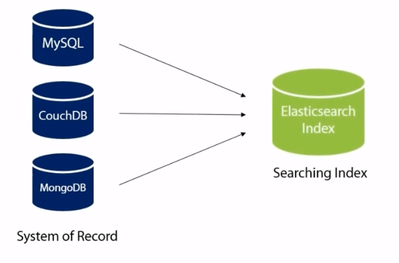
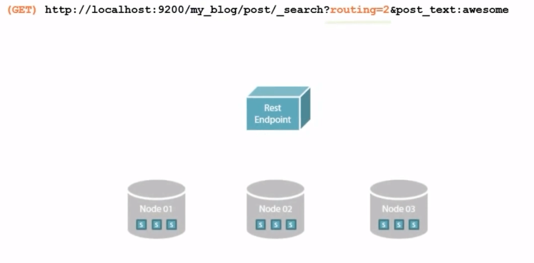

## 2021.11.03_DataType,IndexOptions

## Mappings _source



- 다른 솔루션보다 훨씬 빠르기 때문에 검색에만 사용할 수 있음
- 필요하지 않는 필드를 저장할 수 있음
- 저장한다는 것은 ElasticSearch가 색인을 생성한 데이터 외에도 원본 데이터의 복사본을 보관한다는 의미
  - Elasticsearch의 기본 동작
    - 단점은 인덱스가 커질 수 있음
    - 큰인덱스의 경우 문제가 되지 않지만 저장하는 데이터의 종류에 따라 데이터의 원본 복사본을 저장하지 말고 대신 색인된 버전만 저장하면됨

## 원본데이터 저장하지 않고 색인된 버전만 저장

```json
POST my_blog/post
{ 
  "mappings":{
      "post":{
          "properties":{
              "user_id":{
                  "type":"integer",
                  "store": true
              },
              "post_text":{
                  "type":"text"
              },
              "post_date":{
                  "type":"date"
              },
              "post_word_count":{
                  "type":"integer"
              }
          }
      }
  }
}
POST my_blog/post
{
  "post_text":"yet another blog post!",
  "user_id":1,
  "post_date":"2021-10-30"
}

GET my_blog/post/_search
```

- 이렇게 입력했을때 

```json
{
  "took" : 1,
  "timed_out" : false,
  "_shards" : {
    "total" : 1,
    "successful" : 1,
    "skipped" : 0,
    "failed" : 0
  },
  "hits" : {
    "total" : {
      "value" : 2,
      "relation" : "eq"
    },
    "max_score" : 1.0,
    "hits" : [
      {
        "_index" : "my_blog",
        "_type" : "post",
        "_id" : "NLNh5nwBXp7KZOVOOzI2",
        "_score" : 1.0,
        "_source" : {
          "mappings" : {
            "post" : {
              "properties" : {
                "user_id" : {
                  "type" : "integer",
                  "store" : true
                },
                "post_text" : {
                  "type" : "text"
                },
                "post_date" : {
                  "type" : "date"
                },
                "post_word_count" : {
                  "type" : "integer"
                }
              }
            }
          }
        }
      },
      {
        "_index" : "my_blog",
        "_type" : "post",
        "_id" : "NbNi5nwBXp7KZOVO2DJR",
        "_score" : 1.0,
        "_source" : {
          "post_text" : "yet another blog post!",
          "user_id" : 1,
          "post_date" : "2021-10-30"
        }
      }
    ]
  }
}

```

- 동영상처럼 나오지 않음
- 정확히 검색하기 위한 방법으로는 아래와 같음

```
//이전은 이것
GET my_blog/post/NLNh5nwBXp7KZOVOOzI2?fields=user_id

//현재는 이것
GET my_blog/post/MbNa5nwBXp7KZOVObTI0?stored_fields=user_id

GET my_blog/post/NLNh5nwBXp7KZOVOOzI2?stored_fieldsfields=user_id,post_text
- 적용 안됨
```

```- 
{
  "_index" : "my_blog",
  "_type" : "post",
  "_id" : "MbNa5nwBXp7KZOVObTI0",
  "found" : false
}

```

- _all
  - 모든 데이터의 연결
  - 검색시 모든 색인 필드가 자동으로 포함
  - 검색할 필드를 모를때는 _all 필드를 사용하는것이 편리하지만 인덱스의 크기도 증가하는 점있음

- Routing

  - 라우팅의 목적은 elasticsearch가 찾고있는 데이터를 포함하고 있는 shard에 쿼리를 보내어 빨리 검색할 수 있도록 하는 것
  - 쿼리를 검색할 때 라우팅 매개변수를 사용해야하고, path는 라우트할 필드를 지정

  

  - user_id를 사용하면 Elasticsearch가 임의로가 아니라 user_id를 사용하여 블로그 게시물을 나눌수 있음

  

  - 3개의 노드와 9개의 샤드가 있지만 우리는 쿼리 문자열에 routing=2쿼리 매개 변수를 지정

## Aliases

- 별칭은 일반적으로 응용 프로그램 로그와 같은 항목을 지정하는데 사용하는 경우
- Elasticsearch인덱스가 유지되는 방식때문에 중요할수 있음
- 인덱스를 하루 단위로 유지하는 경우 evenLog에현재날짜를 이름끝에 붙인다고한다면
  - 이설정의 문제는 특정 날짜에 쿼리를 통해 타겟팅 할 색인을 알 수 없다는것
  - 의미가 다른 기본 쿼리를 만들면 어떤 인덱스를 쿼리 문자열에 연결할 지 모르기 때문에
    - elasticsearch에서 인덱스를 볼수 있음


-  별칭으로 닉네임을 만든 다음 원하는 인덱스에 할당 할 수있음 


- 별칭을 설정하면 eventLog를 쿼리 문자열에 넣을 수 있으며 내 쿼리는 별칭 2에 할당

